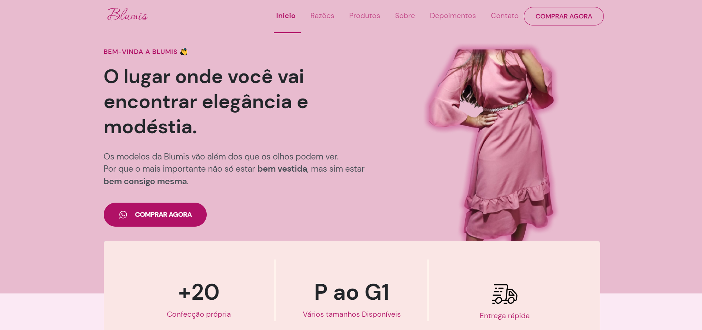

<h1 align=center>👗BLUMIS - Moda Modesta</h1>

---

Landing page desenvolvida para marca Blumis, para exposição da marca e produtos.

## 🔧 Tecnologias:

## 🖊️ Referências:

- NLW - **Return (Mission Origin)** [**[Rocketseat](https://rocketseat.com.br/)**]
- Curso: **Dominando CSS3 com Sass** [**[Hcode Treinamentos](https://hcode.com.br/cursos/css-3)**]
- Libraries:

  - **Scroll Reveal** - Biblioteca JavaScript para animar elementos à medida que eles **_rolam_** para exibição]
  - **Swiper Js** - **_controle deslizante_** de toque móvel gratuito mais moderno , com transições

## 📝 Autor:

A autoria do projeto é própria. As personalizações foram feitas de acordo com alinhamento de expectativas com a cliente **[Blumis](https://www.blumis.com.br/)**. As expectativas do projeto foram atendidas e até mesmo superadas. Graças aos conhecimento obtidos nas referências citadas e muito esforço e disciplina o projeto pode ser concretizado. Possíveis melhorias serão feitas ao decorrer do tempo.

## 📱 Visualizar:

https://www.blumis.com.br/novidades-blumis/
